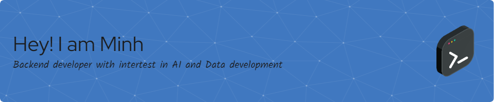

  
### 👋 Welcome to My Page 👋
  

  

  
<!-- Animated typing effect -->

  

<!-- Profile views counter -->

  

---

  
### 🎯 About Me
  
- 🏫 I graduated from [Hanoi University of Science and Technology](https://hust.edu.vn/), majoring in Electronics and Telecommunications Engineering, my works in the undergraduate program mainly focus on AI solution for anomaly detection and speech processing for agriculture domain
- 🏢 Recently, I had over 1 year experience as a Backend Developer.
- 🌱 Currently, I am embarking on the Master Program of Information Technology at [The University of Western Australia](CjwKCAjw_4S3BhAAEiwA_64Yho_M5EntpygeLxLX3Y_hq9Bg7ymv2uCfw5VRNMOxqZL3aPe_dx2MyBoCXKsQAvD_BwE), a top 100 university in [QS Ranking](https://www.topuniversities.com/universities/university-western-australia), with the specialization in Artificial Intelligence. 
- 🎖️ My main techstack focuses on C#, SQl Server and Python for Backend and AI development, but I can also work minorly with Angular, NodeJS for web development and Spark, AWS Service for data pipeline maintenance
- 📅 For the time being, I have shifted my career path to Data Engineering, NLP, LLM and further Mlops development.
- 🚵 I am seeking for a chance to horn my practical skills through project, open source contribution or non-profit technological project, which will act as a precursor to make an advancement in my career as a Software Engineer with the focus on Data and AI engineering.
  

---

  
### 💻 Tech Stack
  
<h3 align="left">Programming languages:</h3>

  
  
  
  
  
  
  

<h3 align="left">Machine Learning/ Deep Learning:</h3>

  
  
  
  

<h3 align="left">Big data development:</h3>

  
  
  
  
  
  
  

<h3 align="left">Web development</h3>

  
  
  
  
  
  
  
  
  
  

<h3 align="left">Databases</h3>

  
  

---

  
### 📊 GitHub Stats
  

  
  

<!-- Animated contribution graph -->

  

---

  
### 🏔️ Most Used Languages | 🔝 Top Contributed Repo
  
<table>
  <tr>
    <td width="50%" align="center">
      
    </td>
    <td width="50%" align="center">
      
    </td>
  </tr>
</table>

---

  
### 🏆 GitHub Trophies
  

---

  
### ✍️ Random Dev Quote
  

---

  
### 📫 How to Reach Me
  
For future collaboration and career discussion, you can contact me at:
  
 

  
<!-- Animated footer -->

<!-- Additional animated elements -->

  

